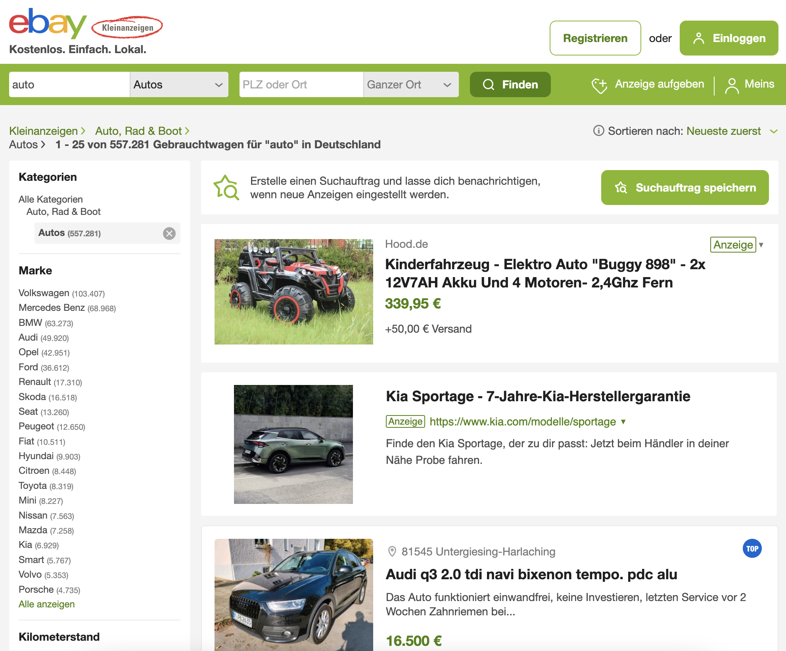

# Ebay car sales - WOP
## Cleaning and Analyzing using Python, Pandas and analytics skills.

I explore a dataset of used cars from [eBay-Kleinanzeigen](https://www.ebay-kleinanzeigen.de/), a classifieds section of the German eBay website.This analysis aims to gather some insights into the brands and popularity of listed cars, then understand relation among caracthersistics and price. As well as, to found best weekday/monthday to post the ad and to expect more seen based on previous data.

### What was done?

- Cleaning
- Removing outliers
- Fixing data types
- Exploring price in function of brands and vehicle types

## Folders
- Data: dataset in `.csv`
- Images: pictures in `.png`
- Code: notebooks in Python saved as `.ipynb`

## Setup

The code was made run in the DataQuest platform using:
- Jupyter Notebook
- [pandas](https://pandas.pydata.org/)
- [NumPy](https://numpy.org/)
- [datetime](https://docs.python.org/3/library/datetime.html)

# The Dataset
The original dataset had over 370.000 records of used cars scraped with Scrapy from eBay-Kleinanzeigen and was available in Kaggle. DataQuest pre-prepared the dataset reduzing to 50.000 entries and provides it.

Descriptions of the variables:   (adapted from [data_world](https://data.world/data-society/used-cars-data) and DataQuest)

- `dateCrawled:` when this ad was first crawled, all field values are taken from this date
- `name`: "name" of the car
- `seller`: whether the advertiser is private or commercial
- `offerType`: the type of listing, if offer or request
- `price`: the price on the ad to sell the car
- `abtest`: control or test
- `vehicleType`:  the vehicle Type
- `yearOfRegistration`: at which year the car was first registered
- `gearbox`: the transmission type
- `powerPS`: the power of the car in PS
- `model`: the car model name
- `odometer`: the measure of how many kilometers the car has driven
- `monthOfRegistration`: at which month the car was first registered
- `fuelType`: what type of fuel the car uses
- `brand`: the brand of the car
- `notRepairedDamage`: if the car has damage which is not been repaired yet
- `dateCreated`: the date for which the ad at eBay was created
- `nrOfPictures`: the number of pictures in the ad
- `postalCode`: the postal code for the location of the vehicle
- `lastSeenOnline`: when the crawler saw this ad last online

